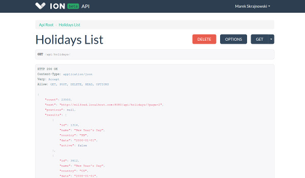

ION API documentation
============================

**ION is still heavily in development, so the API is subject to change.**

# Authentication

Currently ION only supports per-user token authentication. You just need to add the `Authorization` header to your requests:

```
Authorization: Token YOUR_ACCESS_TOKEN
```

Check the [Authentication page](authentication/README.md) for more details

# Sample code & examples

Coming soon...

# Browsable API

To experiment with the API, you can use the browsable version. Just log in to your ION and open `your-domain.ionapp.com/api/` in your favourite browser. It's not feature complete, but it's a great way to explore ION's resources and data structures.



# Supported data formats

The API supports JSON and HTML (the browsable API).

To ensure you get a JSON response, you can either add a `Content-Type: application/json` header to your request or add a `?format=json` query to the url.

# Pagination

Most of ION's resources are paginated. To control the pagination you can use `page` and `limit` query parameters, eg.:

`https://your-domain.ionapp.com/api/holidays/?page=2&limit=10` which will fetch the 2nd page of holiday items, 10 items at a time. The response will look something like this:

```json
{
    "count": 23503,
    "next": "https://your-domain.ionapp.com/api/holidays/?page=3",
    "previous": "https://your-domain.ionapp.com/api/holidays/?page=1", 
    "results": [
        ...
    ]
}
```

`count` - total number of found items  
`next` - url to the next page or `null` if it's the final one  
`previous` - url to the previous page or `null` if it's the first one  
`results` - page contents, an array of found items  

If the resource doesn't contain the requested page, it will respond with `404 Not found`.

The default `limit` is 100.

# Resources
[/api/calendar/](resources/calendar.md)  
[/api/holidays/](resources/holidays.md)  
[/api/profile_schema/](resources/profile_schema.md)  
[/api/profiles/](resources/profiles.md)  
[/api/schedules/](resources/schedules.md)  
[/api/tenant/](resources/tenant.md)  
[/api/timeoff_requests/](resources/timeoff_requests.md)  
[/api/timezones/](resources/timezones.md)  
[/api/tokens/](resources/tokens.md)  
[/api/users/](resources/users.md)  

# Need more help?

If you need more information about some part of the API, or you found a bug in the documentation, feel free to [open an issue here on github](https://github.com/IONapp/api-docs/issues).

