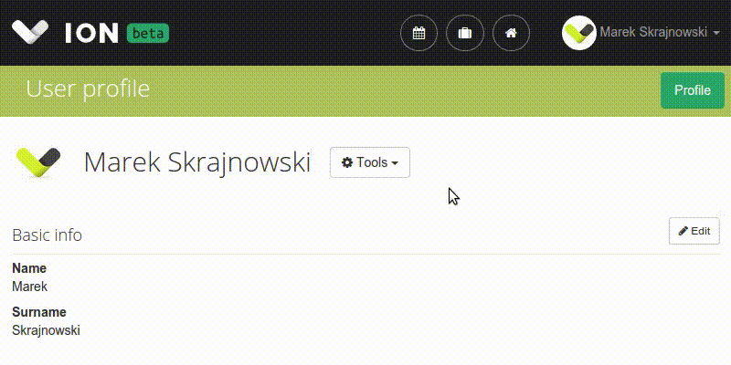

ION Authentication
=========================

# Basic Authentication

You can authenticate your requests using HTTP Basic Authentication, specifying your ION user's email and password. If you're logging in through Google, you'll need to set a separate password for your account.

## Example
```
# curl
curl https://your-domain.ionapp.com/api/users/ \
     --user john.doe@example.com:password

# httpie
http https://your-domain.ionapp.com/api/users/ \
     -a john.doe@example.com:password
```

# Token Authentication
For integrating services with ION, we recommend using per-user access tokens.You can obtain a token from your profile page:



Then you just need to include the token in the `Authorization` header of your requests:

```
Authorization: Token YOUR_ACCESS_TOKEN
```

## Example

```bash
# curl
curl https://your-domain.ionapp.com/api/users/ \
     --header "Authorization: Token YOUR_ACCESS_TOKEN"

# httpie
http https://your-domain.ionapp.com/api/users/ \
     "Authorization:Token YOUR_ACCESS_TOKEN"
```
