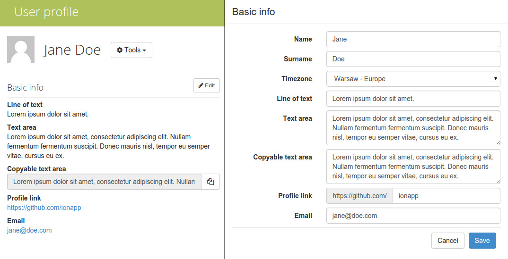

Profile fields /api/profile_schema/
========================================

## Field types

`line` - Line of text  
Short text, edited using a simple input field, eg. phone number.

`text` - Text Area  
Longer text, edited using a text area, eg. other information.

`email` - Email address  
Email address, rendered as a mailto: link, edited using an input with email validation, eg. private email address.

`link` - Profile Link  
Link to an external profile. Edited using an input with a prefix addon, which
displays the base url, eg. github profile. `options` stores the profile base url.

`copyable-text` - Text area with 'copy' button  
Frequently used piece of text, rendered as an input with a copy button, edited 
using a text area, eg. public ssh key.



## List fields

`GET /api/profile_schema/`

#### Example

Response for the layout visible above.

```json
HTTP 200 OK

[
    {
        "field_type": "line", 
        "field_name": "Line of text", 
        "field_placeholder": "Short text", 
        "options": ""
    }, 
    {
        "field_type": "text", 
        "field_name": "Text area", 
        "field_placeholder": "Long text", 
        "options": "https://github.com/"
    }, 
    {
        "field_type": "copyable-text", 
        "field_name": "Copyable text area", 
        "field_placeholder": "Copyable text", 
        "options": "https://github.com/"
    }, 
    {
        "field_type": "link", 
        "field_name": "Profile link", 
        "field_placeholder": "Username", 
        "options": "https://github.com/"
    }, 
    {
        "field_type": "email", 
        "field_name": "Email", 
        "field_placeholder": "john@example.com", 
        "options": null
    }
]
```

## Update fields

`POST /api/profile_schema/`

Only available to administrators.

#### Fields

`field_type` - one of the field types listed above  
`field_name` - name of the field  
`field_placeholder` - placeholder value, which will be displayed in empty inputs  
`options` - additional field settings, only required for some field types, eg. to specify the profile link base url  

You can either add a field to the current schema by sending a single object, or replace the whole schema with a new one by sending a list.

__Note__  
Schema changes do not affect stored field values, so if you delete a field by accident, you can just add it back and all user profile data should be preserved.

#### Examples

Add a phone number field to the schema.

```json
POST /api/profile_schema/

{
    "field_type": "line", 
    "field_name": "Phone number", 
    "field_placeholder": "+49 123 456 789", 
    "options": ""
}
```

```json
HTTP 200 OK

[
    {
        "field_type": "line", 
        "field_placeholder": "Short text", 
        "field_name": "Line of text", 
        "options": ""
    }, 
    {
        "field_type": "text", 
        "field_placeholder": "Long text", 
        "field_name": "Text area", 
        "options": "https://github.com/"
    }, 
    {
        "field_type": "copyable-text", 
        "field_placeholder": "Copyable text", 
        "field_name": "Copyable text area", 
        "options": "https://github.com/"
    }, 
    {
        "field_type": "link", 
        "field_placeholder": "Username", 
        "field_name": "Profile link", 
        "options": "https://github.com/"
    }, 
    {
        "field_type": "email", 
        "field_placeholder": "john@example.com", 
        "field_name": "Email", 
        "options": null
    }, 
    {
        "field_type": "line", 
        "field_name": "Phone number", 
        "field_placeholder": "+49 123 456 789", 
        "options": ""
    }
]
```

Replace the schema

```json
POST /api/profile_schema/

[
    {
        "field_type": "line", 
        "field_name": "Phone number", 
        "field_placeholder": "+49 123 456 789", 
        "options": ""
    },
    {
        "field_type": "email", 
        "field_name": "Private email", 
        "field_placeholder": "john@example.com", 
        "options": null
    }
]
```

```json
HTTP 200 OK

[
    {
        "field_type": "line", 
        "field_name": "Phone number", 
        "field_placeholder": "+49 123 456 789", 
        "options": ""
    }, 
    {
        "field_type": "email", 
        "field_name": "Private email", 
        "field_placeholder": "john@example.com", 
        "options": null
    }
]
```
